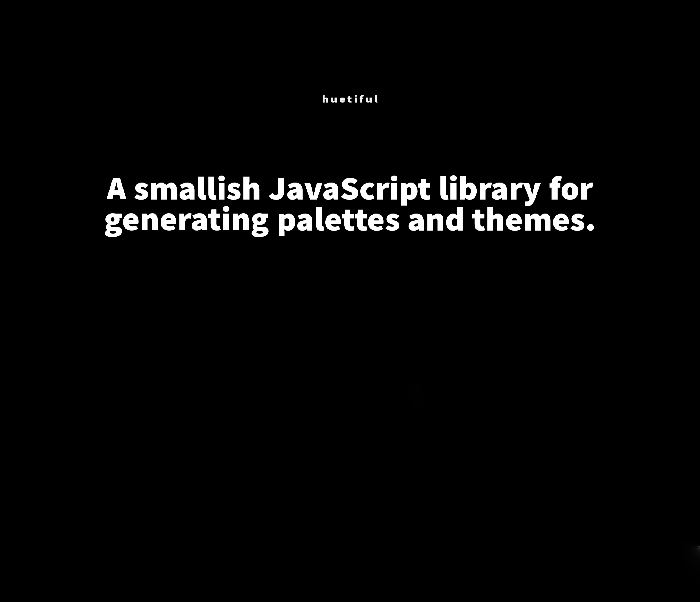

### Huetiful🎨 color utilities

This is more of a collection of handy utilities (honestly I wouldn't call it a library😂). 

Interested in [contributing](https://github.com/prjctimg/huetiful/issues/new/choose) ? Feel free to open an issue or comment on the currently open ones and let's build it the way you would want it!

 ### Color maps🗺️

The functions can consume `Map` objects to predict palettes or themes. These include

Colors from Material Design
Gradients from uigradients
ColorBrewer color scales
Named colors from CSS

### Gradients🌌

A gradient generator function can produce custom gradients i.e light or dark gradients. 

The function could take an array of colors and then return a Map of the light and dark variants of the colors passed

### Hue shifted palettes🌅

Inspired by George Francis' post on (link) this function takes a base color and returns an array of hue shifted colors.

### Tonal palettes👨🏾‍🎨

Inspired by Material Design Guidelines this function can take a `Map` of key value pairs that specify the primary, secondary and or accent color and returns the tonal palettes per each key in an array

### Theme generator

*** Still thinking 🤔

