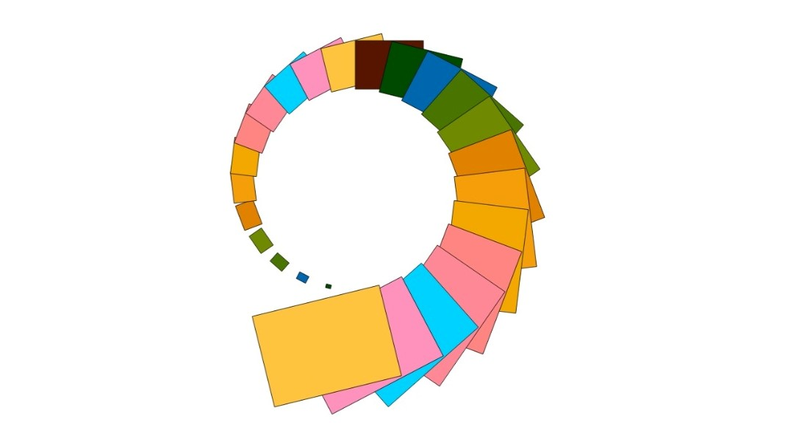

[](https://www.npmjs.com/package/huetiful-js)
[](https://bundlephobia.com/package/huetiful-js)
[](https://github.com/eslint/eslint)
[](https://www.paypal.com/donate/?hosted_button_id=CRFWNCE6EW5X2)
[](https://twitter.com/deantarisai)


  <p align='center'>
    
  </p>
<h3 align='center'>huetiful-js</h3>

<p align='center'>TypeScript library for general purpose color manipulations and generating custom color scales.
<br>
<br>
 <a href="https://prjctimg.github.io/huetiful">📜 Docs</a>
    ·
    <a href="https://github.com/prjctimg/prjctimg/issues/new?template=---bug-report.md">🐞 Report Bug</a>
    ·
    <a href="https://github.com/prjctimg/huetiful/issues/new?template=---feature-request.md">🍩 Request Feature</a>
    ·
    <a href="https://github.com/prjctimg/huetiful/wiki">🧠 Wiki </a>
</p>

### Table of Contents

- [Installation and usage🛠️](#installation-and-usage)
  - [Node🖥️](#node)
  - [Browser🌐](#browser)
  - [Quickstart🏁](#quickstart)
  - [Documentation 📜](#documentation-)
- [Community👥](#community)
  - [Need help💁🏽‍♂️ ?](#-need-help-)
  - [Contributing🏋🏼‍♀️](#-contributing)
  - [License⚖️](#license)

<br>

#### Installation and usage🛠️

##### Node🖥️

The library🧾 is on npm as a package📦 for use in NodeJS:

```bash
npm i huetiful-js
```

You can use a CDN in this example, jsdelivr to load the library remotely:

```js
import {...} from 'https://cdn.jsdelivr.net/npm/huetiful-js/lib/huetiful.esm.mjs'

```

##### Browser🌐

Or load the library as a UMD glabal (`huetiful`) in your HTML file using a `<script>` tag:

```html
# With script tag

<script src='https://cdn.jsdelivr.net/npm/huetiful-js/dist/huetiful.umd.js'></script>
```

##### Quickstart🏁

[See the Quickstart section on the Wiki](https://github.com/prjctimg/huetiful/wiki/Quickstart-%F0%9F%8F%81) to see some examples and demonstrations of the library.

##### Documentation 📜
With 50+ utilities for querying, setting and manipulating collections of color, the power to take your creative coding skills is at your finger tips! 
Want to explore the full API? [See the full docs here](https:prjctimg.github.io/huetiful)
<br>

### Community👥

Would like to join the chat🗣️ and share ideas💡 and suggestions💭 ? [See the discussions and just say hi, or share a coding meme(whatever breaks the ice🏔️)](https://github.com/prjctimg/huetiful/discussions)

#### Need help💁🏽‍♂️ ?

See some unexpected results😖? [Check the issue tracker](https://github.com/prjctimg/huetiful/issues) to open an issue or search for the problem to see if your issue already exists or has been resolved.

#### Contributing🏋🏼‍♀️

See🔍 the [CONTRIBUTING](./CONTRIBUTING.md) file for more information on how to get started.


[](https://github.com/prjctimg/huetiful/stargazers)

[](https://github.com/prjctimg/huetiful/network/members)

##### License⚖️

<code align='center'>
Released under the Apache-2.0 license
</code>
<code align='center'>&copy; 2023 Dean Tarisai
</code>
<code align='center'>&lt;/&gt; with ♥ in Crowhill
</code>
